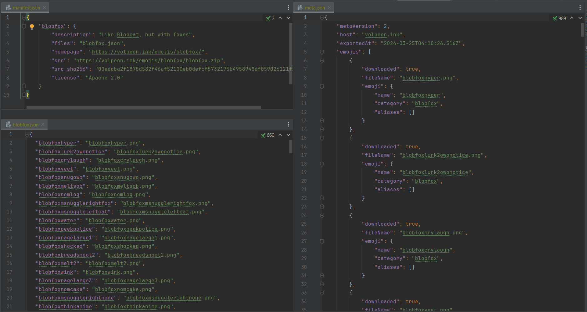

# fedi-admin-scripts

Small collection of scripts, tools, and queries meant for use by fediverse system administrators.
These scripts are meant for use with Sharkey and/or Akkoma, but can be adapted for other server software.

## blocklist-import: synchronize domain blocks across servers

This script connects to multiple remote instances and applies a common set of domain blocks.
One or more mastodon-format domain blocklists can be loaded, and the included blocks will be added to all attached instances. The tooling will automatically merge domains that appear in multiple entries, and remote instances are introspected to ensure that blocks are never duplicated on the server. Sharkey, Pleroma, and Akkoma are all supported.

Additionally, the script can generate block announcement posts including domain, actions taken, and reasons. Posts are returned in Markdown format for easy posting on any instance software. A future update will include support for automatically publishing an announcement without user involvement. 

### Usage:

This script is currently rather difficult to use, due to the lack of a proper authentication method. You will need to capture a session token for your admin account(s) before running the script. (see step 3 for more details.)

1. Add blocklists to the `data` directory (or another accessible location).
2. Copy [`config/importBlocklist.example.js`](config/importBlocklist.example.js) to `config/importBlocklist.js` and fill out the "sources" property. For each list, add a line like this: `{ type: 'mastodon', path: 'data/whatever-block-list.csv' },`.
3. Fill out the "remotes" property with connection details for your instance(s). Use the provided examples, and be sure to change the "host" property to match. The "token" should be an active session token from an admin account - you can get this through the web browser dev tools. Hint: for sharkey, capture a `POST` request and look for the `i` property. For Akkoma, open Admin-FE and take the `Authorization` header from any request. Remove the `Bearer` part and any whitespace.
4. Run `npm install` (you only have to do this once)
5. Run `npm run import-blocklist` and the script will begin importing blocks. Progress will be printed for each block and instance.

### Tips:

* You can set `dryRun` to `true` in order to test your configuration and connection settings. All blocks will be processed, but no changes will be saved to the instances.
* If you get any kind of error like "unauthorized" or "unauthenticated", then check your access tokens. They may need to be replaced if much time has passed.

## blocklist-download

Using admin APIs, downloads the blocklist from any Sharkey, Pleroma, or Akkoma instance into a mastodon-style blocklist.
Block details are mapped into mastodon's format using the same logic as import-blocklist.

### Usage:

Execute `npm run blocklist-download -- <save_path> <connection_string>`.
`save_path` is the name of a file to contain the download blocklist.
`connection_string` defines a connection to the remote instance, in `software://token@host` format.

## blocklist-diff

Generate a simple diff between two mastodon-style blocklist files.
The resulting CSV will contain every domain that appears in any list, along with the block severity for each list that contains it.

### Usage:

Execute `npm run blocklist-diff -- <diff_file> <source_1> <source_2> [source_3] [...]`.
`diff_file` is the file to contain the generated diff, and all remaining parameters are blocklists to compare.

## follow-relations: SQL query for listing cross-server follow relationships

This query is intended for use with Sharkey, although it should work with any Misskey-based instance. It will return a table of (follower, followee) rows where one side is a user from your local instance and the other is a user from one of a provided set of target instance(s).

### Usage:

1. Edit [`printFollowRelations.sql`](src/follow-relations/printFollowRelations.sql) and replace the example instances with those that you want to check. 
2. Connect to Sharkey's PostgreSQL database and execute the script.

## pack-for-misskey: Convert an emoji pack from Pleroma to Misskey format

Given the URL of an emoji pack in Pleroma / Akkoma format, this script will download it and generate a matching `meta.json` to enable its use with Misskey.
Multiple manifest files can be linked, and all packs in the manifest will be downloaded.
The resulting files are left in a named folder for the user to zip up.

**Important: this script does not validate pack filenames and paths.**
Make sure to only import packs from trusted sources, or else your computer could be vulnerable to attacks.

### Usage:

1. Edit the `config` property in [`packForMisskey.ts`](src/pack-for-misskey/packForMisskey.ts) to specify manifest files and output directory.
2. Run `npm install` (you only have to do this once)
3. Run `npm run pack-for-misskey`

## full-text-index: Create a full-text index for faster note search

This script will create an additional indexes on the `note` and `user` tables, providing much faster search at the cost of additional disk space.
The PostgreSQL `pg_trgm` extension is enabled to support queries using `LIKE` and `ILIKE`, which ensures that Sharkey's search implementation will work as-is.
An additional script is provided to remove the indexes.

### Installation:

Execute [`create-full-text-index.sql`](src/full-text-index/create-full-text-index.sql) on the Sharkey database and wait for completion.
This may take a long time, up to an hour for very large databases.
If you get an error on the `CREATE EXTENSION` line, check that `pg_trgm` is installed as a PostgreSQL module or system package.

### Removal:

1. [Optional] If you are using `pg_trgm` for other purposes, then comment out the last `DROP EXTENSION` line.
2. Execute [`drop-full-text-index.sql`](src/full-text-index/drop-full-text-index.sql) on the Sharkey database.